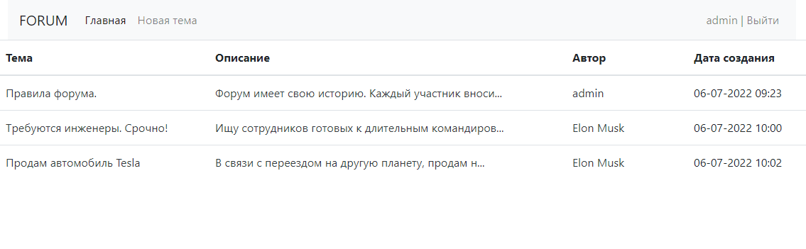
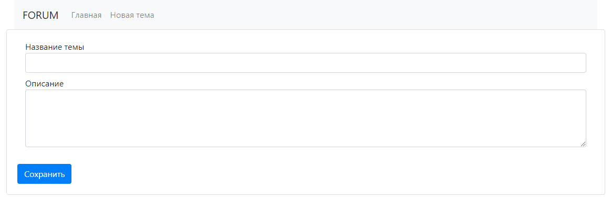
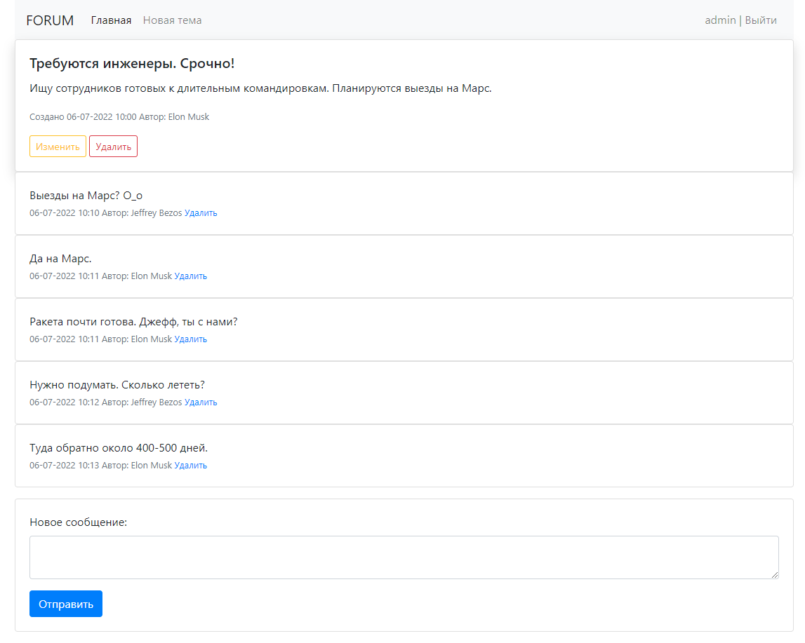
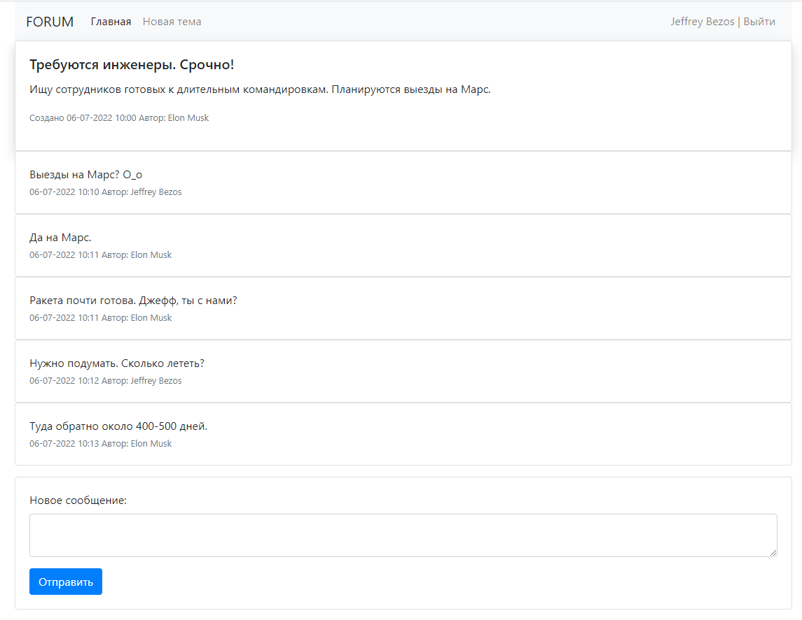
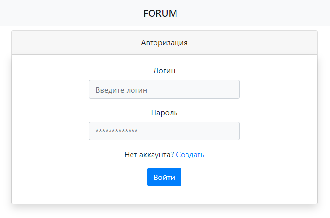
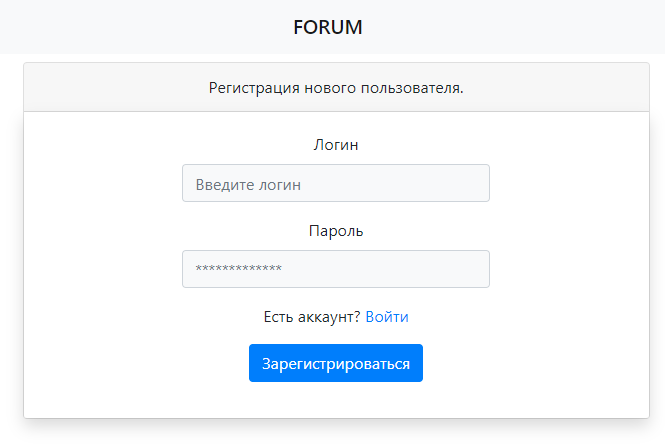

# job4j_forum

## О проекте.

#### Описание
Web-приложение форум.

#### Технологии
> JDK11, Maven, Spring Boot, Spring Data, Spring MVC, Spring Security, Liquibase, Mockito

## Использование

Главное окно приложения состоит из списка тем форума.

Можно добавить новую тему

Перейдя в тему, можно просмотреть список сообщений в теме, добавить новое сообщение.

Пользователь с ролью "Admin" может удалять сообщения, редактировать и удалять темы.
Обычные пользователи могут редактировать и удалять только свои темы.

Все зарегистрированные пользователи хранятся в БД. Форма авторизации:

Есть возможность регистрации новых пользователей. Форма регистрации:

### Контакты:
[][telegram]
[][gmail]
[][linkedin]

[telegram]: https://t.me/GrokDen
[gmail]: mailto:den.voiten@gmail.com
[linkedin]: https://www.linkedin.com/in/denis-voytenko-585488117/

